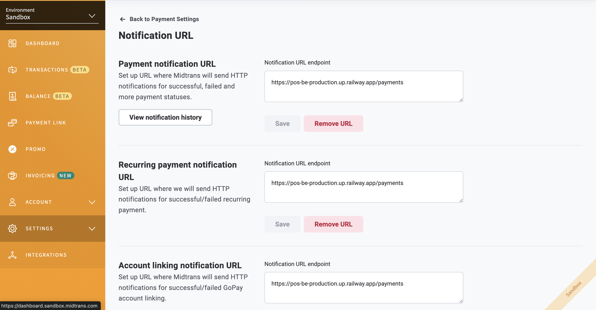

# POS-BE

This project is a **Point of Sales Backend (POS-BE)** built using **Gin Framework**, **PostgreSQL (CockroachDB)**, and **Midtrans** as the payment gateway.

## Using Midtrans in Sandbox Mode

You can use Midtrans in sandbox (development) mode for testing payments without using real transactions. To enable this, ensure your MIDTRANS_SERVER_KEY is set to the sandbox key provided by Midtrans.
To receive payment status updates from Midtrans, configure the **Notification URL** in your Midtrans dashboard.


For more details, visit the Midtrans Sandbox Documentation.

## Using CockroachDB PostgreSQL

This project supports CockroachDB as the database, and you can use the free-tier version provided by CockroachDB. To get started:

Sign up for a free account at CockroachDB Cloud.

Create a free PostgreSQL-compatible database.

Set up the database connection using the provided connection string.

## Project Setup

### 1. Set Environment Variables
Create a `.env` file inside the `env` folder and set the required environment variables:

```env
STAGE=dev
DB_NAME=pos
DB_USERNAME=
DB_PASSWORD=
DB_HOST=
DB_SCHEMA=dev
DB_URL=
MIDTRANS_SERVER_KEY=
```

### 2. Run Database Migration
To create the schema and tables in your database, run the following command:
```sh
go run initTables/main.go
```

### 3. Start the API Server
Run the API server locally on port **4000**:
```sh
go run main.go
```

The API will be available at:
```
http://localhost:4000/{path}
```
where `{path}` represents the specific service endpoints, which can be found in `main.go` or the provided API documentation.

## Project Structure

```
POINT OF SALES BE
│── env/
│   ├── dev.env
│   ├── prod.env
│
│── initTables/
│   ├── main.go         # Script to initialize database schema and tables
│
│── libraries/
│   ├── config/         # Configuration files (database, environment variables, etc.)
│   ├── helpers/        # Utility/helper functions
│   ├── api/apiResponse # API response handling
│
│── models/             # Database models
│   ├── API-response.go
│   ├── main.go
│
│── services/           # Business logic and API endpoints
│   ├── categories.go
│   ├── initServices.go
│   ├── payments.go
│   ├── products.go
│   ├── transactionProducts.go
│   ├── transactions.go
│
│── main.go             # Main entry point of the application
│── go.mod              # Go module file
│── go.sum              # Dependency lock file
│── .gitignore          # Git ignore file
│── readme.md           # Project documentation
```

### Explanation:
- **libraries/**: Contains reusable components such as configuration, helpers, and API response handlers.
- **models/**: Defines the database models.
- **services/**: Contains the main business logic and service handlers.
- **initTables/**: Script to initialize the database schema and tables.
- **main.go**: The main entry point that starts the Gin web server.

## Deployment on Railway
This project has been deployed on **Railway.com**.

### Deploying on Railway:
1. Create a Railway account at [Railway.app](https://railway.app/).
2. Deploy the project.
3. Set the environment variables in **Railway's environment settings** (as it does not use local `.env` files).
4. Run the application on Railway.

## API Documentation
You can find the deployed API documentation and test the endpoints here:
[Postman API Documentation](https://postman.com)

---
If you have any questions or issues, feel free to contribute or raise an issue in the repository. Happy coding! 🚀

